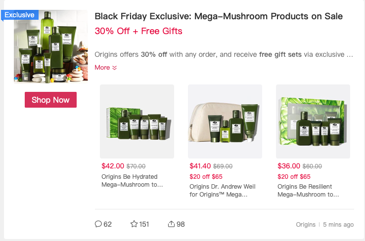

## Intro:
This repository is developed to support the Back End operation of the [Brand Trend Webapp](http://trend-flask-env.eba-ubjwp9wg.us-east-1.elasticbeanstalk.com/). The webapp provides a simple interface for presenting the daily trends of curated brands. For detailed description on this project and the Front End, please refer to [AWS-BrandTrend-webapp](https://github.com/MTang0728/AWS-BrandTrend-webapp). 

The Back End workflow is constructed using a serverless data pipeline and incorporates the idea of Continuous Integration, where data are collected continuously and automatically from designated resouces. This pipeline is depicted in the figure below:

## Features:
- 100% on Cloud
- Serverless Data ETL & Pipeline
- Cutstomizable & Scalable
- Continuous Integration

## Technology Used:
- AWS CloudWatch Timer
- AWS Lambda
- AWS DynamoDB
- AWS SQS 
- AWS S3

### Tools Used: 
- [PyTrends](https://pypi.org/project/pytrends/#caveats): Unofficial Google Trend API. 

## Back End Description:

### Scraper Lambda: Web-scraping from Dealmoon

- [Dealmoon](dealmoon.com) is a North American shopping-guide website that curates the latest deals across the internet. It makes frequent updates and post current available sales for various kinds of brands. One of these posts is shown in the figure below:
- This Lambda function has a trigger set up with CloudWatch Timer that goes off every day.

From each post, we then scrap the brand name and post, and save them in a table in DynamoDB.

### Producer Lambda:
- The function moves everything from all exisiting items in a AWS DynamoDB table to AWS SQS and clears the DynamoDB table after data transfer.
- This Lambda function has a trigger set up with CloudWatch Timer that goes off every day.

### Consumer Lambda:
- This funtion moves messages from AWS SQS one at a time, and processes each message with the Google Trend API before saving the final result in AWS S3.
- Google Trend API accepts a brand name and returns the brand's trend for the day in a dataframe. This dataframe contains a timetamp column and the corresponding trend value at each timestamp.
- This Lambda function has a trigger set up that goes off everytime there is a new message in AWS SQS.